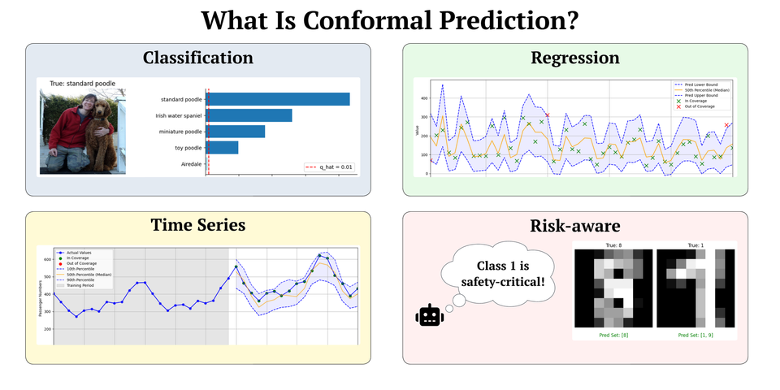

# Conformal Prediction Algorithms
This tutorial is a deep dive into conformal prediction (CP)- a framework designed to provide reliable uncertainty quantification (UQ). We will cover: what CP is and its basic concepts, an in-depth dive into conformal prediction methods and state-of-the-art methods with code, and a bunch of resources to help you use CP in your next project! By the end of this tutorial, you’ll have a deep, intuitive, and technical understanding of CP, enabling you to apply it confidently in your work whether you are a beginner or an expert. Let’s get started! Please see my [beginner-friendly blog post](https://daniel-bethell.co.uk/posts/conformal-prediction-guide/).

  

### Getting Started
All the necessary code is contained within a Jupyter Notebook in this repository. 

If you would like to use a GPU on colab you can change this setting by selecting `Change Runtime Type -> GPU`, otherwise select `cpu`.

### Files
This repository contains the following files:
* `CPAlgorithms.ipynb` - A detailed Jupyter Notebook that will guide readers through how to use CP throughout a multitude of tasks.
